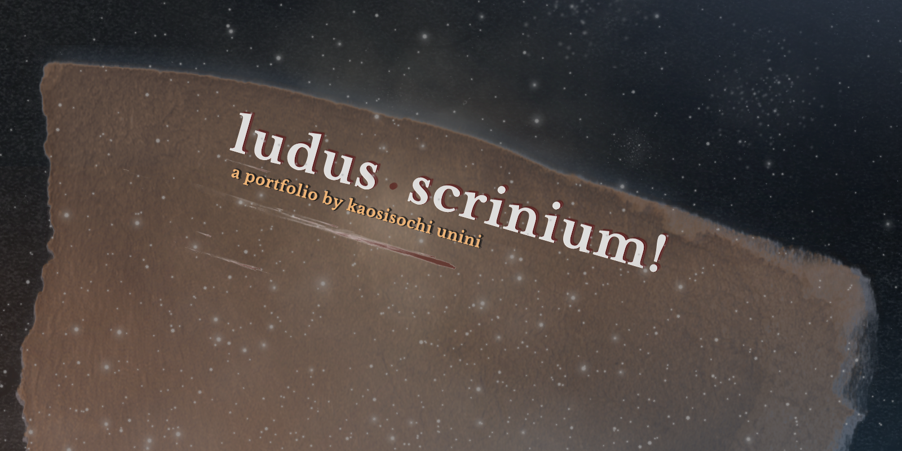

<!-- Hero banner (optional): add /docs/hero.png and it will show up in social previews -->

  

<h1 align="center">ludus scrinium</h1>

  simulated game content ops •<em> a portfolio, by kaosisochi unini </em>

  <a href="#links">links</a> •
  <a href="#intent">intent</a> •
  <a href="#outcomes">outcomes</a> •
  <a href="#roadmap">roadmap</a> •
  <a href="#projects">projects</a> •
  <a href="#contact">contact</a>

---

## links
- **roadmap (public summary):** [docs/roadmap.md](docs/roadmap.md)
- **demos (60–90s clips):**
  - *(placeholder)* Asset Atlas — `/demo/asset-atlas-v0.mp4`
  - *(placeholder)* PlayLens — `/demo/playlens-v0.mp4`
  - *tip:* if a repo has a Streamlit/YouTube demo, link it from that repo’s README.
- **try it in 5 minutes:**
  1. Pick a repo below and open its **`/docs/SETUP.md`**.
  2. Run the quick-start (or watch the demo clip).
  3. Read the **one-pager** in `/docs` to understand what you’re seeing.
- **practices (how this lab runs):**
  - **Ship weekly:** at least one deliverable flips to **Done** with a link.
  - **WIP cap:** never more than **3** items in **Doing** on the board.
  - **Evidence-first:** every claim points to a demo, doc, or metric.

## intent
A public, working lab for **content operations in video games**. Six small systems that make assets findable, UX changes provable, player feedback actionable, text shippable, fan content safe, and decisions reusable.

- **Audience:** producers, content leads, UX/ops folks at game studios
- **Proof over claims:** every week adds a link or clip you can click

## outcomes
1. **Findable assets** — *Asset Atlas* (search + tags)
2. **Proven UX improvements** — *PlayLens* (test → fix → retest)
3. **Player feedback → action** — *Patch Notes Oracle* (themes, sentiment, triage)
4. **Text shipped on time** — *Localization Conveyor* (write → translate → proof → done)
5. **Safe creator submissions** — *Creator Ops Kit* (intake, review, recognition)
6. **Reusable decisions** — *Producer’s Almanac* (decision logs, templates)

## roadmap
**Public summary:** see milestones and latest demos here → [docs/roadmap.md](docs/roadmap.md)  
*(Full weekly roadmap and decision logs live privately in Confluence; summaries land here when they’re stable.)*

## projects
- **Asset Atlas** — make game files easy to find and reuse  
  Repo: https://github.com/ludus-scrinium/asset-atlas
- **PlayLens** — test one screen/flow; show the improvement  
  Repo: https://github.com/ludus-scrinium/playlens
- **Patch Notes Oracle** — turn player comments into a “do-this” list  
  Repo: https://github.com/ludus-scrinium/patch-notes-oracle
- **Localization Conveyor** — text from write → translate → proof → ship  
  Repo: https://github.com/ludus-scrinium/localization-conveyor
- **Creator Ops Kit** — safe fan content intake + review + recognition  
  Repo: https://github.com/ludus-scrinium/creator-ops-kit
- **Producer’s Almanac** — decisions, retros, templates  
  Repo: https://github.com/ludus-scrinium/producers-almanac

## contact
**Kaosisochi "Kaosi" Unini** — [LinkedIn](linkedin.com/in/kaosisochiunini) • <kaosisochiunini@gmail.com>

---

### notes
- License: **MIT** (sample assets may have their own licenses; see repo notes).
- Credits: tools and libraries acknowledged inside each repo.
