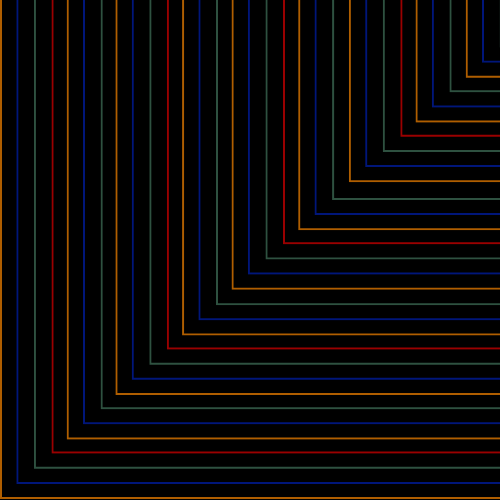

  

  

# Ludus • Scrinium — Roadmap

---

## Phase 1 — Setup (Weeks 1-6)

### Current Sprint Window (Weeks 1-4)
<!-- LS:ROADMAP_WIDGET_START -->

- week 1  
  - [x] Hub and repos scaffolded  
  - [x] Verified all hub links — [view hub README](https://github.com/ludus-scrinium/ludus-scrinium-hub/blob/main/README.md)  
  - _Producer’s note:_ first-time GitHub setup was dizzying but gratifying.

- week 2  
  - [x] Prototype surface for PlayLens (demo clip)  
  - [x] Published [A/B demo on LinkedIn](https://www.linkedin.com/posts/activity-7386397223867072513-kUua)  
  - _A measured example of QA / UX thinking._

- week 3  
  - [ ] Asset Atlas: field definitions + 100-sample table

- week 4  
  - [ ] Basic search and filter prototype (live view)

**Overall:** 50 % complete across 4 goals
<!-- LS:ROADMAP_WIDGET_END -->

- [ ] week 5 — Usability test plan + pilot sessions  
- [ ] week 6 — Producer’s Almanac templates v1

---

## Phase 2 — Core Systems (Weeks 7-18)

**Milestones**
- A  PlayLens v1 shipped (before / after results)  
- B  Asset Atlas v1 searchable prototype

---

## Phase 3 — Player Signal (Weeks 19-26)

**Milestone C** — Patch Notes Oracle v1 with triage dashboard

---

## Phase 4 — Content at Scale (Weeks 27-34)

**Milestone D** — Localization Conveyor v1 live with multi-region QA

---

## Phase 5 — Integrate & Polish (Weeks 35-40)

**Milestone E** — All systems connected; studio packet assembled

---

## Phase 6 — Validate & Ship (Weeks 41-44)

**Milestone F** — Public demo + testimonials released

---

### Latest Demos
*(to be added)*

---

  

  

